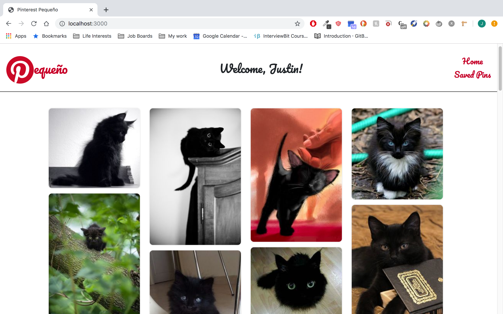
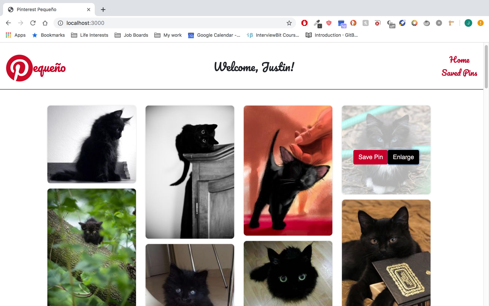
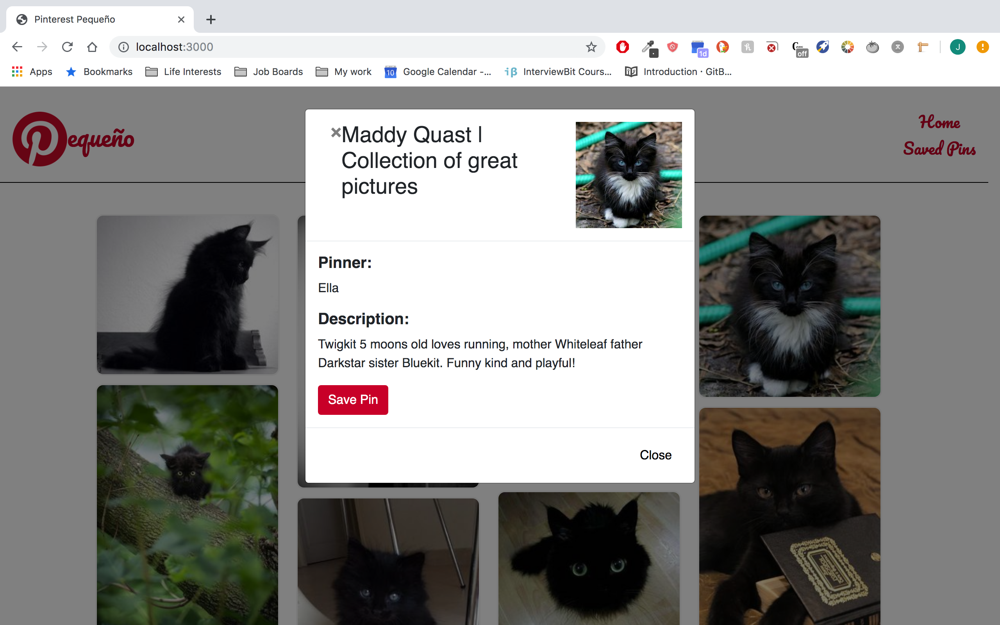

Thanks for visiting the 'Pequeño'/Pin-Lite repo, a small (pequeño) mirror of Pinterest.

To get started, please see the 'README' in the `pin-lite-client` level of the directory for instructions on tethering the client project to the backend project.

Notes:

In building this project, I had to rollback from React/React Dom v 16 to v 15.6.2 so that my modals would work :). The good folks at react-bootstrap are working on portals to get modals up and running on v 16.

I used `React-Stack-Grid` to partition the layout for the time being. It has the design layout I wanted (similar to Pinterest's) but I discovered the drawing/repainting animation engine (and the image/button overlays) can be a bit wobbly/lags every once in a while. Would definitely appreciate feedback on this.

This project was bootstrapped with [Create React App](https://github.com/facebookincubator/create-react-app).

--Justin

Project Screenshots:

